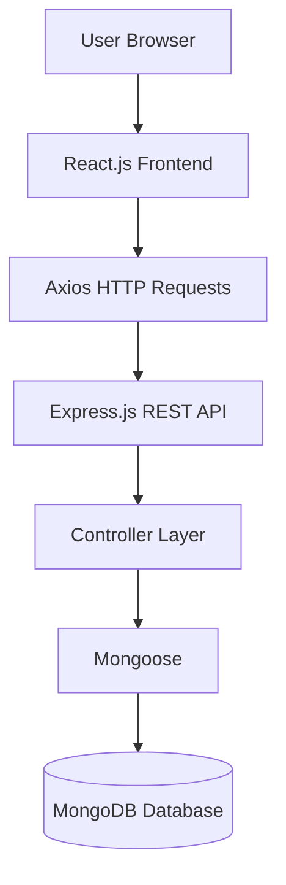
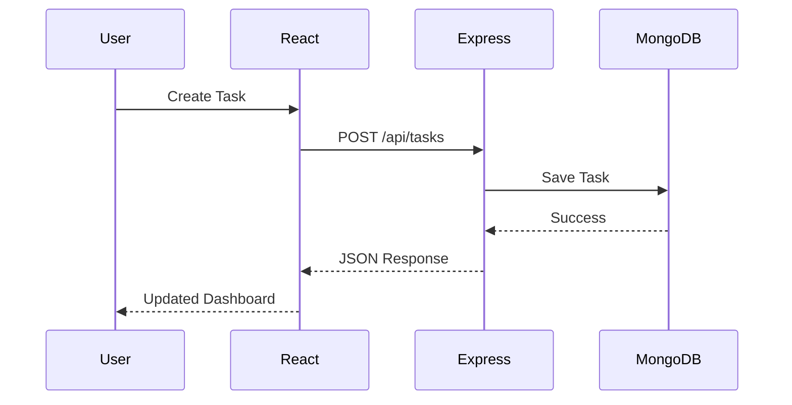
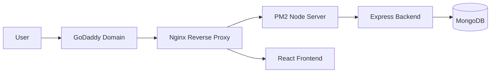
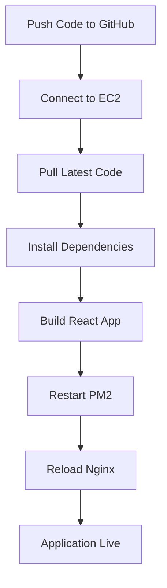

# 📋 Task Management System

<p align="center">


</p>

<p align="center">

A modern <b>Full-Stack Task Management System</b> built with <b>React.js</b>, <b>Node.js</b>, <b>Express.js</b>, and <b>MongoDB</b> that enables users to efficiently manage daily tasks through a responsive web interface.

</p>

---

# 📖 Table of Contents

- [Project Overview](#-project-overview)
- [Objectives](#-objectives)
- [Key Features](#-key-features)
- [Technology Stack](#-technology-stack)
- [System Architecture](#-system-architecture)
- [Application Workflow](#-application-workflow)
- [Project Structure](#-project-structure)
- [Installation Guide](#-installation-guide)
- [Environment Variables](#-environment-variables)
- [Running the Application](#-running-the-application)
- [REST API Documentation](#-rest-api-documentation)
- [Database Design](#-database-design)
- [Screenshots](#-screenshots)
- [AWS EC2 Deployment](#-aws-ec2-deployment)
- [GoDaddy Domain Configuration](#-godaddy-domain-configuration)
- [Production Deployment](#-production-deployment)
- [Troubleshooting](#-troubleshooting)
- [Future Enhancements](#-future-enhancements)
- [Contributing](#-contributing)
- [Author](#-author)
- [License](#-license)

---

# 📖 Project Overview

The **Task Management System** is a full-stack web application developed using **React.js**, **Node.js**, **Express.js**, and **MongoDB**. The application enables users to manage daily tasks by performing **Create, Read, Update, and Delete (CRUD)** operations through a responsive and user-friendly interface.

The frontend communicates with the backend using **REST APIs**, while the backend stores and retrieves task data from **MongoDB**.

The project follows a **client-server architecture**, where React handles the user interface, Express.js manages API requests, and MongoDB serves as the database layer. This architecture ensures scalability, maintainability, and efficient data management.

This application demonstrates modern full-stack development practices including:

- Component-based UI development
- RESTful API architecture
- Database integration with MongoDB
- Client-server communication using Axios
- Responsive web design
- Modular project structure
- Full CRUD implementation

---

# 🎯 Objectives

The primary objectives of this project are:

- Develop a responsive frontend using **React.js**.
- Build a RESTful backend using **Node.js** and **Express.js**.
- Store application data in **MongoDB**.
- Perform complete **CRUD** operations on tasks.
- Connect frontend and backend through **REST APIs**.
- Implement modular and maintainable project architecture.
- Practice version control using **Git** and **GitHub**.
- Deploy the application on **AWS EC2**.
- Configure production deployment using **PM2** and **Nginx**.
- Connect a custom domain using **GoDaddy DNS**.

---
# ✨ Key Features

| Category | Features |
|----------|----------|
| 📋 **Task Management** | • Create new tasks<br>• View all tasks<br>• Edit existing tasks<br>• Delete tasks<br>• Update task status<br>• Manage task priorities<br>• Set due dates |
| 📊 **Dashboard** | • View task statistics<br>• Pending task count<br>• Completed task count<br>• Priority-based task management<br>• Responsive dashboard layout |
| 🎨 **User Interface** | • Clean Bootstrap UI<br>• Responsive Design<br>• Mobile Friendly<br>• Reusable React Components<br>• Easy Navigation<br>• User-friendly Forms |
| ⚙️ **Backend Features** | • RESTful API<br>• CRUD Operations<br>• MongoDB Integration<br>• Express Routing<br>• MVC Architecture<br>• Environment Variable Support<br>• Error Handling |

# 🛠 Technology Stack

## Frontend Technologies

| Technology | Description |
|------------|-------------|
| React.js | JavaScript library for building user interfaces |
| React Router DOM | Client-side routing |
| Axios | API communication |
| Bootstrap 5 | Responsive UI framework |
| HTML5 | Web page structure |
| CSS3 | Styling |

---

## Backend Technologies

| Technology | Description |
|------------|-------------|
| Node.js | JavaScript runtime |
| Express.js | Backend framework |
| Mongoose | MongoDB Object Modeling |
| MongoDB | NoSQL Database |
| CORS | Cross-Origin Resource Sharing |
| dotenv | Environment configuration |

---

## Development Tools

| Tool | Purpose |
|------|---------|
| Git | Version Control |
| GitHub | Source Code Hosting |
| VS Code | Code Editor |
| Postman | API Testing |
| MongoDB Compass | Database Management |
| AWS EC2 | Cloud Deployment |
| PM2 | Process Manager |
| Nginx | Reverse Proxy |

---

# 📚 Technology Overview

## React.js

React.js is an open-source JavaScript library developed by **Meta** for building interactive and reusable user interfaces. It follows a component-based architecture and uses the Virtual DOM to efficiently update the user interface.

### Advantages

- Component-based architecture
- Fast rendering using Virtual DOM
- Easy state management with Hooks
- Single Page Application (SPA)
- Reusable UI components

---

## Node.js

Node.js is an open-source JavaScript runtime environment that executes JavaScript code on the server side. It enables developers to build scalable and high-performance backend applications using JavaScript.

### Advantages

- Fast execution
- Event-driven architecture
- Non-blocking I/O
- Highly scalable
- JavaScript for both frontend and backend

---

## Express.js

Express.js is a lightweight framework built on Node.js that simplifies backend development through routing, middleware support, and REST API creation.

### Advantages

- Simple routing
- Middleware support
- REST API development
- Lightweight
- High performance

---

## REST API

REST (Representational State Transfer) is an architectural style used for communication between frontend and backend using standard HTTP methods.

### HTTP Methods

| Method | Purpose |
|---------|----------|
| GET | Retrieve task data |
| POST | Create new task |
| PUT | Update existing task |
| DELETE | Delete task |

---

## MongoDB

MongoDB is a NoSQL document-oriented database that stores data in flexible JSON-like documents. It integrates seamlessly with Node.js applications using Mongoose.

### Advantages

- Flexible schema
- High performance
- Horizontal scalability
- Easy Mongoose integration
- JSON document storage

---
---

# 🏗️ System Architecture

The application follows a **Three-Tier Architecture**, separating the presentation layer, application layer, and database layer.



---

## Architecture Components

| Layer | Technology | Purpose |
|---------|------------|---------|
| Presentation Layer | React.js | User Interface |
| API Layer | Express.js | REST APIs |
| Business Logic | Node.js | Process Requests |
| Database Layer | MongoDB | Store Tasks |
| ORM | Mongoose | Database Modeling |

---

# 🔄 Application Workflow



---

## Request Flow

### 1️⃣ User Interaction

The user interacts with the React application by:

- Creating Tasks
- Editing Tasks
- Viewing Tasks
- Deleting Tasks

↓

### 2️⃣ Frontend Processing

React Components

↓

Axios Service

↓

REST API

↓

### 3️⃣ Backend Processing

Express Router

↓

Controller

↓

Business Logic

↓

Mongoose

↓

### 4️⃣ Database

MongoDB

↓

Stores Task Information

↓

Returns JSON Response

↓

### 5️⃣ Frontend Update

React automatically updates the user interface after receiving the API response.

---

# 📂 Project Structure

```text
Task-Management-System/
│
├── backend/
│   ├── config/
│   │   └── db.js
│   │
│   ├── controllers/
│   │   └── taskController.js
│   │
│   ├── models/
│   │   └── Task.js
│   │
│   ├── routes/
│   │   └── taskRoutes.js
│   │
│   ├── server.js
│   ├── package.json
│   ├── package-lock.json
│   └── .env
│
├── frontend/
│   ├── public/
│   │
│   ├── src/
│   │   ├── components/
│   │   ├── pages/
│   │   ├── services/
│   │   ├── App.js
│   │   ├── App.css
│   │   ├── index.js
│   │   └── index.css
│   │
│   ├── package.json
│   ├── package-lock.json
│   └── .env
│
├── README.md
└── .gitignore
```

---

# 📁 Folder Description

## backend/

Contains the complete backend application.

### config/

Stores MongoDB database configuration.

### controllers/

Contains business logic for CRUD operations.

### models/

Defines MongoDB schemas using Mongoose.

### routes/

Defines all REST API endpoints.

### server.js

Application entry point.

---

## frontend/

Contains the complete React application.

### components/

Reusable UI components.

### pages/

Application pages.

### services/

Axios API configuration.

### App.js

Main React component.

### index.js

Application entry point.

---

# ⚙️ Prerequisites

Before running the application, install the following software:

| Software | Version |
|------------|----------|
| Node.js | 18+ |
| npm | Latest |
| MongoDB | Latest |
| Git | Latest |
| VS Code | Recommended |

---

# 💻 Installation Guide

## Step 1 — Clone Repository

```bash
git clone https://github.com/your-username/Task-Management-System.git
```

---

## Step 2

Move into project directory

```bash
cd Task-Management-System
```

---

## Step 3

Install Backend Dependencies

```bash
cd backend
npm install
```

---

## Step 4

Install Frontend Dependencies

```bash
cd ../frontend
npm install
```

---

# 🌍 Environment Variables

## Backend (.env)

```env
PORT=5000

MONGODB_URI=mongodb://127.0.0.1:27017/taskmanager
```

---

## Frontend (.env)

```env
REACT_APP_API_URL=http://localhost:5000/api/tasks
```

---

# ▶️ Running the Application

## Start MongoDB

```bash
mongod
```

---

## Start Backend

```bash
cd backend

npm run dev
```

Expected Output

```
MongoDB Connected Successfully

Server running on port 5000
```

---

## Start Frontend

```bash
cd frontend

npm start
```

Expected Output

```
Compiled Successfully!

Local:

http://localhost:3000
```

---

# 🌐 Access the Application

| Service | URL |
|----------|-----|
| Frontend | http://localhost:3000 |
| Backend API | http://localhost:5000 |
| MongoDB | localhost:27017 |

---

# 🔍 Verify Installation

✔ Node.js Installed

```bash
node -v
```

✔ npm Installed

```bash
npm -v
```

✔ MongoDB Installed

```bash
mongod --version
```

✔ Git Installed

```bash
git --version
```

---

# 🧪 Project Verification Checklist

- ✔ Repository Cloned
- ✔ Backend Dependencies Installed
- ✔ Frontend Dependencies Installed
- ✔ MongoDB Running
- ✔ Backend Server Running
- ✔ Frontend Server Running
- ✔ React Connected to Backend
- ✔ CRUD Operations Working
- ✔ API Responses Verified
- ✔ Database Connected

---
---

# 📡 REST API Documentation

The backend exposes a set of RESTful APIs that allow the frontend to perform CRUD (Create, Read, Update, Delete) operations on tasks.

## Base URL

### Local Development

```
http://localhost:5000/api/tasks
```

### Production

```
https://your-domain.com/api/tasks
```

---

# API Endpoints

| Method | Endpoint | Description |
|---------|----------|-------------|
| GET | /api/tasks | Retrieve all tasks |
| GET | /api/tasks/:id | Retrieve a task by ID |
| POST | /api/tasks | Create a new task |
| PUT | /api/tasks/:id | Update an existing task |
| DELETE | /api/tasks/:id | Delete a task |

---

# 1. Get All Tasks

**Endpoint**

```http
GET /api/tasks
```

### Description

Returns all tasks stored in the database.

### Sample Response

```json
[
  {
    "_id": "66512ab45c98f8d4",
    "title": "Complete AWS Assignment",
    "description": "Deploy application on EC2",
    "status": "Pending",
    "priority": "High",
    "dueDate": "2026-07-30"
  }
]
```

---

# 2. Get Task by ID

**Endpoint**

```http
GET /api/tasks/:id
```

### Example

```http
GET /api/tasks/66512ab45c98f8d4
```

### Response

```json
{
    "_id":"66512ab45c98f8d4",
    "title":"Complete AWS Assignment",
    "description":"Deploy application",
    "status":"Pending",
    "priority":"High"
}
```

---

# 3. Create Task

**Endpoint**

```http
POST /api/tasks
```

### Request Body

```json
{
    "title":"Learn Docker",
    "description":"Practice Docker Compose",
    "status":"Pending",
    "priority":"Medium",
    "dueDate":"2026-07-25"
}
```

### Success Response

```json
{
    "message":"Task created successfully"
}
```

---

# 4. Update Task

**Endpoint**

```http
PUT /api/tasks/:id
```

### Request Body

```json
{
    "status":"Completed"
}
```

### Response

```json
{
    "message":"Task updated successfully"
}
```

---

# 5. Delete Task

**Endpoint**

```http
DELETE /api/tasks/:id
```

### Response

```json
{
    "message":"Task deleted successfully"
}
```

---

# HTTP Status Codes

| Status Code | Meaning |
|-------------|----------|
| 200 | Success |
| 201 | Created |
| 400 | Bad Request |
| 404 | Resource Not Found |
| 500 | Internal Server Error |

---

# 🗄 Database Design

The application uses **MongoDB** as its primary database.

## Database

```
taskmanager
```

---

## Collection

```
tasks
```

---

## Task Document Structure

```json
{
    "_id":"ObjectId",
    "title":"Learn React",
    "description":"Complete React Hooks",
    "status":"Pending",
    "priority":"High",
    "dueDate":"2026-07-25",
    "createdAt":"2026-07-21",
    "updatedAt":"2026-07-21"
}
```

---

# Database Schema

| Field | Type | Description |
|---------|------|-------------|
| _id | ObjectId | Unique Identifier |
| title | String | Task Title |
| description | String | Task Description |
| status | String | Pending / Completed |
| priority | String | High / Medium / Low |
| dueDate | Date | Due Date |
| createdAt | Date | Creation Time |
| updatedAt | Date | Last Update Time |

---

# Mongoose Schema Example

```javascript
const TaskSchema = new mongoose.Schema({
    title: String,
    description: String,
    status: String,
    priority: String,
    dueDate: Date
},{
    timestamps:true
});
```

---

# 📸 Screenshots

Add screenshots of your application to showcase the user interface.

## Home Page

```
docs/screenshots/home.png
```

---

## Dashboard

```
docs/screenshots/dashboard.png
```

---

## Create Task

```
docs/screenshots/create-task.png
```

---

## Edit Task

```
docs/screenshots/edit-task.png
```

---

## Delete Task

```
docs/screenshots/delete-task.png
```

---

## MongoDB Compass

```
docs/screenshots/mongodb.png
```

---

## Backend Terminal

```
docs/screenshots/backend-terminal.png
```

---

## Frontend Terminal

```
docs/screenshots/frontend-terminal.png
```

---

## AWS EC2 Deployment

```
docs/screenshots/aws-ec2.png
```

---

# 🧪 API Testing Using Postman

The APIs were tested using **Postman** before integrating with the React frontend.

---

## POST Request

```
POST /api/tasks
```

Request Body

```json
{
    "title":"Deploy Project",
    "description":"Deploy React Application",
    "status":"Pending",
    "priority":"High"
}
```

---

## GET Request

```
GET /api/tasks
```

Returns all tasks.

---

## PUT Request

```
PUT /api/tasks/:id
```

Updates an existing task.

---

## DELETE Request

```
DELETE /api/tasks/:id
```

Deletes a selected task.

---

# Testing Checklist

- ✅ API Connected
- ✅ MongoDB Connected
- ✅ GET Working
- ✅ POST Working
- ✅ PUT Working
- ✅ DELETE Working
- ✅ React Integration Successful
- ✅ JSON Responses Verified
- ✅ Error Handling Tested

---
---

# ☁️ AWS EC2 Deployment

This project can be deployed on an **AWS EC2 Ubuntu Server** for production use. The deployment uses **Node.js**, **MongoDB**, **PM2**, and **Nginx** to provide a reliable and scalable hosting environment.

---

# Deployment Architecture



---

# Prerequisites

Before deployment, ensure you have:

- AWS Account
- EC2 Ubuntu Instance
- Security Group configured
- SSH Key Pair
- GitHub Repository
- GoDaddy Domain
- Node.js
- Git
- Nginx
- PM2

---

# Launch EC2 Instance

## Instance Configuration

| Setting | Value |
|---------|-------|
| AMI | Ubuntu Server 24.04 LTS |
| Instance Type | t2.micro (Free Tier) |
| Storage | 20 GB |
| Key Pair | Your Existing Key |
| Security Group | HTTP, HTTPS, SSH |

---

# Configure Security Group

| Port | Protocol | Purpose |
|------|----------|---------|
| 22 | TCP | SSH |
| 80 | TCP | HTTP |
| 443 | TCP | HTTPS |
| 3000 | TCP | React (Optional) |
| 5000 | TCP | Backend (Optional) |

---

# Connect to EC2

```bash
ssh -i your-key.pem ubuntu@YOUR_PUBLIC_IP
```

---

# Update Ubuntu

```bash
sudo apt update

sudo apt upgrade -y
```

---

# Install Git

```bash
sudo apt install git -y
```

Verify installation:

```bash
git --version
```

---

# Install Node.js

```bash
curl -fsSL https://deb.nodesource.com/setup_20.x | sudo -E bash -

sudo apt install nodejs -y
```

Verify:

```bash
node -v

npm -v
```

---

# Clone Repository

```bash
git clone https://github.com/your-username/Task-Management-System.git

cd Task-Management-System
```

---

# Install Backend Dependencies

```bash
cd backend

npm install
```

---

# Install Frontend Dependencies

```bash
cd ../frontend

npm install
```

---

# Configure Environment Variables

## Backend

Create `.env`

```env
PORT=5000

MONGODB_URI=your_mongodb_connection_string
```

---

## Frontend

```env
REACT_APP_API_URL=http://YOUR_SERVER_IP:5000/api/tasks
```

---

# Build React Application

```bash
cd frontend

npm run build
```

The production-ready files will be generated inside the `build/` directory.

---

# 🚀 PM2 Process Manager

PM2 keeps the backend running even after server restarts and automatically restarts the application if it crashes.

---

## Install PM2

```bash
sudo npm install -g pm2
```

Verify:

```bash
pm2 -v
```

---

## Start Backend

```bash
cd backend

pm2 start server.js --name task-backend
```

---

## View Running Processes

```bash
pm2 list
```

---

## Monitor Logs

```bash
pm2 logs task-backend
```

---

## Restart Application

```bash
pm2 restart task-backend
```

---

## Stop Application

```bash
pm2 stop task-backend
```

---

## Enable Auto Start on Reboot

```bash
pm2 startup

pm2 save
```

---

# 🌐 Install Nginx

```bash
sudo apt install nginx -y
```

Verify:

```bash
nginx -v
```

---

# Start Nginx

```bash
sudo systemctl start nginx

sudo systemctl enable nginx
```

---

# Configure Reverse Proxy

Create a new configuration file:

```bash
sudo nano /etc/nginx/sites-available/task-management
```

Paste:

```nginx
server {

    listen 80;

    server_name venugopalareddy.in www.venugopalareddy.in;

    location / {

        root /home/ubuntu/Task-Management-System/frontend/build;

        index index.html;

        try_files $uri /index.html;
    }

    location /api {

        proxy_pass http://localhost:5000;

        proxy_http_version 1.1;

        proxy_set_header Upgrade $http_upgrade;

        proxy_set_header Connection 'upgrade';

        proxy_set_header Host $host;

        proxy_cache_bypass $http_upgrade;
    }
}
```

---

Enable configuration

```bash
sudo ln -s /etc/nginx/sites-available/task-management /etc/nginx/sites-enabled/
```

Test configuration

```bash
sudo nginx -t
```

Restart Nginx

```bash
sudo systemctl restart nginx
```

---

# 🌍 GoDaddy Domain Configuration

Log in to your GoDaddy account and navigate to **DNS Management**.

Add the following DNS records:

| Type | Host | Value |
|------|------|-------|
| A | @ | EC2 Public IP |
| A | www | EC2 Public IP |

Save the records and wait for DNS propagation (usually a few minutes to a few hours).

---

# 🔒 Enable HTTPS with Let's Encrypt

Install Certbot:

```bash
sudo apt install certbot python3-certbot-nginx -y
```

Generate an SSL certificate:

```bash
sudo certbot --nginx -d venugopalareddy.in -d www.venugopalareddy.in
```

Verify automatic renewal:

```bash
sudo certbot renew --dry-run
```

---

# 📦 Production Deployment Checklist

- ✅ Ubuntu Server Updated
- ✅ Git Installed
- ✅ Node.js Installed
- ✅ Project Cloned
- ✅ Dependencies Installed
- ✅ Environment Variables Configured
- ✅ React Production Build Created
- ✅ Backend Running with PM2
- ✅ Nginx Configured
- ✅ Domain Connected
- ✅ HTTPS Enabled
- ✅ Application Accessible from Browser

---

# 📈 Deployment Workflow



---
---

# 🔧 Troubleshooting

Below are some common issues you may encounter during development or deployment and their solutions.

## MongoDB Connection Error

**Problem**

```
MongoNetworkError: failed to connect to server
```

**Solution**

- Ensure MongoDB service is running.
- Verify the MongoDB connection string in `.env`.
- Check firewall and network settings if using MongoDB Atlas.

---

## Backend Server Not Starting

**Problem**

```
EADDRINUSE: Address already in use
```

**Solution**

Find the process using the port:

```bash
lsof -i :5000
```

Kill the process:

```bash
kill -9 <PID>
```

Restart the server.

---

## React Application Not Loading

**Problem**

Blank page or build errors.

**Solution**

```bash
cd frontend
rm -rf node_modules
npm install
npm start
```

---

## CORS Error

**Problem**

```
Access-Control-Allow-Origin
```

**Solution**

Enable CORS in Express:

```javascript
const cors = require("cors");

app.use(cors());
```

---

## Environment Variables Not Working

**Solution**

- Verify `.env` file location.
- Restart the application after making changes.
- Ensure variable names are correct.

---

## Nginx 502 Bad Gateway

**Possible Causes**

- Backend application is not running.
- Incorrect proxy configuration.
- Wrong backend port.

Verify PM2:

```bash
pm2 list
```

Restart backend:

```bash
pm2 restart task-backend
```

---

## PM2 Process Not Running

Check logs:

```bash
pm2 logs
```

Restart:

```bash
pm2 restart all
```

---

## Git Pull Conflicts

```bash
git status

git stash

git pull

git stash pop
```

---

# 📈 Performance Optimizations

This project includes several practices to improve performance:

- Component-based architecture
- RESTful API communication
- Modular backend structure
- MongoDB indexing support
- Environment-based configuration
- Production-ready React build
- PM2 process management
- Nginx reverse proxy

---

# 🔒 Security Best Practices

- Store sensitive values in `.env`
- Never commit `.env` files
- Use HTTPS in production
- Configure firewall rules
- Validate user inputs
- Keep dependencies updated
- Enable secure HTTP headers
- Restrict server access using security groups

---

# 🚀 Future Enhancements

The project can be enhanced with additional features such as:

## Authentication & Authorization

- User Registration
- User Login
- JWT Authentication
- Password Reset
- Role-Based Access Control (RBAC)

---

## Task Management

- Task Categories
- Labels and Tags
- Search Tasks
- Filter Tasks
- Task Sorting
- Pagination
- Recurring Tasks

---

## Notifications

- Email Notifications
- Push Notifications
- Due Date Reminders
- Calendar Integration

---

## File Management

- File Attachments
- Image Uploads
- Document Uploads

---

## Dashboard

- Analytics Dashboard
- Progress Charts
- Weekly Reports
- Monthly Reports
- Productivity Insights

---

## DevOps Enhancements

- Docker
- Docker Compose
- Kubernetes
- GitHub Actions CI/CD
- Jenkins Pipeline
- Terraform Deployment
- AWS ECS
- AWS EKS

---

## Monitoring

- Prometheus
- Grafana
- AWS CloudWatch
- Log Monitoring

---

# 🤝 Contributing

Contributions are welcome!

If you'd like to improve this project:

1. Fork the repository.
2. Create a new feature branch.
3. Commit your changes.
4. Push the branch.
5. Open a Pull Request.

---

## Contribution Workflow

```text
Fork Repository
      │
      ▼
Create Feature Branch
      │
      ▼
Develop Feature
      │
      ▼
Commit Changes
      │
      ▼
Push to GitHub
      │
      ▼
Create Pull Request
      │
      ▼
Code Review
      │
      ▼
Merge into Main
```

---

# 📄 License

This project is licensed under the **MIT License**.

You are free to:

- Use
- Modify
- Distribute
- Share

with proper attribution.

---

# 👨‍💻 Author

**Venu Gopala Reddy Eppala**

- 💼 **Role:** AWS Cloud & DevOps Engineer
- 🌐 **Portfolio:** https://venugopalareddy.in
- 💻 **GitHub:** https://github.com/venugopalareddyeppala
- 🔗 **LinkedIn:** https://www.linkedin.com/in/venu-gopala-reddy-eppala

---

# 🙏 Acknowledgements

Special thanks to the open-source community and the creators of:

- React.js
- Node.js
- Express.js
- MongoDB
- Bootstrap
- Axios
- AWS
- GitHub
- Nginx
- PM2

---

# ⭐ Support

If you found this project useful:

- ⭐ Star this repository
- 🍴 Fork the repository
- 🐞 Report issues
- 💡 Suggest new features

Your support helps improve the project and motivates future development.

---

# 📌 Project Summary

The **Task Management System** is a modern full-stack web application built with **React.js**, **Node.js**, **Express.js**, and **MongoDB**. It demonstrates practical implementation of CRUD operations, RESTful APIs, responsive UI design, and production deployment on **AWS EC2** using **PM2** and **Nginx**.

This project showcases skills in:

- Full-Stack Web Development
- REST API Development
- MongoDB Database Design
- React Component Architecture
- Node.js & Express Backend Development
- AWS Cloud Deployment
- Linux Server Administration
- Nginx Reverse Proxy Configuration
- PM2 Process Management
- Git & GitHub Version Control

---

<p align="center">
  <b>⭐ If you like this project, don't forget to give it a star! ⭐</b>
</p>

<p align="center">
Made with ❤️ by <b>Venu Gopala Reddy Eppala</b>
</p>
